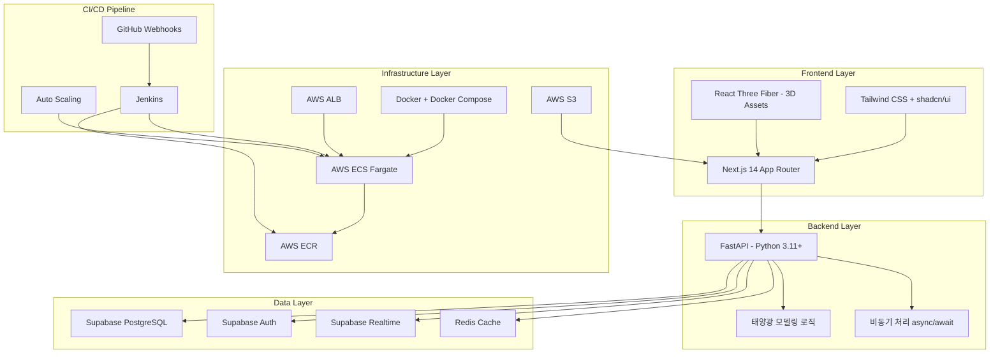
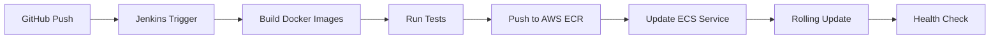

# 🚛 Energy Truck - 제주 P2P 에너지 거래 플랫폼

> **온디맨드 에너지 모빌리티**로 제주도 신재생 에너지 출력 제한(Curtailment) 문제를 해결하는 혁신적인 플랫폼

## 📖 목차
- [프로젝트 개요](#프로젝트-개요)
- [시스템 아키텍처](#시스템-아키텍처)
- [기술 스택](#기술-스택)
- [웹 애플리케이션 미리보기](#웹-애플리케이션-미리보기)
- [프로젝트 구조](#프로젝트-구조)
- [개발 환경 설정](#개발-환경-설정)
- [배포 전략](#배포-전략)

---

## 🎯 프로젝트 개요

**Energy Truck**은 제주도의 신재생 에너지 출력 제한 문제를 해결하기 위한 P2P 에너지 거래 플랫폼입니다.

### 핵심 컨셉
- **서비스명**: Energy Truck (에너지 트럭)
- **목표**: 신재생 에너지 Curtailment 해결
- **UX 철학**: 토스(Toss) 스타일의 극단적인 간결함, 여백의 미, 부드러운 애니메이션

### 주요 기능
- ⚡ **실시간 에너지 거래**: P2P 방식의 에너지 매매
- 📊 **태양광 출력 모델링**: AI 기반 발전량 예측
- 💰 **SMP 가격 연동**: 실시간 전력 시장 가격 반영
- 🔐 **안전한 인증**: Supabase Auth 기반 사용자 관리

---

## 🏗️ 시스템 아키텍처



### 아키텍처 설명

#### 1️⃣ **Frontend Layer**
- **Next.js 14**: App Router를 활용한 서버 사이드 렌더링
- **Tailwind CSS + shadcn/ui**: 토스 스타일의 미니멀한 UI 구현
- **React Three Fiber**: 3D 에너지 트럭 비주얼 에셋

#### 2️⃣ **Backend Layer**
- **FastAPI**: 고성능 비동기 Python 웹 프레임워크
- **태양광 모델링**: 발전량 예측 및 출력 제한 계산 로직
- **비동기 처리**: `async/await`로 병목 현상 방지

#### 3️⃣ **Data Layer**
- **Supabase PostgreSQL**: 메인 데이터베이스
- **Supabase Auth**: 사용자 인증 및 세션 관리
- **Supabase Realtime**: 실시간 거래 업데이트
- **Redis**: SMP 가격 및 모델링 결과 캐싱

#### 4️⃣ **Infrastructure Layer**
- **Docker**: 컨테이너화된 애플리케이션
- **AWS ECS Fargate**: 서버리스 컨테이너 실행
- **AWS ECR**: Docker 이미지 레지스트리
- **AWS ALB**: 로드 밸런싱 및 트래픽 분산
- **AWS S3**: 정적 파일 및 3D 에셋 저장

#### 5️⃣ **CI/CD Pipeline**
- **GitHub Webhooks**: 코드 Push 시 자동 트리거
- **Jenkins**: 빌드, 테스트, 배포 자동화
- **Auto Scaling**: CPU/메모리 기반 자동 확장

---

## 🛠️ 기술 스택

### Frontend
| 기술 | 버전 | 용도 |
|------|------|------|
| Next.js | 16.0.10 | React 프레임워크 |
| React | 19.2.0 | UI 라이브러리 |
| TypeScript | 5.x | 타입 안정성 |
| Tailwind CSS | 4.1.9 | 스타일링 |
| shadcn/ui | Latest | UI 컴포넌트 |
| Framer Motion | 12.29.2 | 애니메이션 |
| React Three Fiber | 9.5.0 | 3D 그래픽 |
| Recharts | 2.15.4 | 데이터 시각화 |

### Backend (예정)
| 기술 | 버전 | 용도 |
|------|------|------|
| FastAPI | Latest | 웹 프레임워크 |
| Python | 3.11+ | 프로그래밍 언어 |
| Pydantic | Latest | 데이터 검증 |
| SQLAlchemy | Latest | ORM |
| Redis | Latest | 캐싱 |

### Database & Auth
| 기술 | 용도 |
|------|------|
| Supabase PostgreSQL | 메인 데이터베이스 |
| Supabase Auth | 사용자 인증 |
| Supabase Realtime | 실시간 데이터 동기화 |

### DevOps
| 기술 | 용도 |
|------|------|
| Docker | 컨테이너화 |
| Docker Compose | 로컬 개발 환경 |
| Jenkins | CI/CD 파이프라인 |
| AWS ECS Fargate | 컨테이너 오케스트레이션 |
| AWS ECR | 컨테이너 레지스트리 |
| AWS ALB | 로드 밸런서 |
| AWS S3 | 정적 파일 스토리지 |

---

## 🌐 웹 애플리케이션 미리보기

### 로컬 개발 환경에서 실행하기

#### 방법 1: npm 사용 (현재 가능)

```bash
# 1. 프론트엔드 디렉토리로 이동
cd c:\workspace2\aws_pro1\energy-trading-app

# 2. 의존성 설치 (처음 한 번만)
npm install

# 3. 개발 서버 실행
npm run dev

# 4. 브라우저에서 열기
# http://localhost:3000
```

#### 방법 2: Docker 사용 (예정)

```bash
# 1. 프로젝트 루트로 이동
cd c:\workspace2\aws_pro1

# 2. Docker Compose로 전체 스택 실행
docker-compose up

# 3. 브라우저에서 열기
# Frontend: http://localhost:3000
# Backend API: http://localhost:8000
# API Docs: http://localhost:8000/docs
```

### 빌드 및 프로덕션 실행

```bash
# 프로덕션 빌드
npm run build

# 프로덕션 서버 실행
npm start
```

### 주요 엔드포인트 (예정)

| 엔드포인트 | 설명 |
|-----------|------|
| `http://localhost:3000` | 메인 웹 애플리케이션 |
| `http://localhost:8000` | FastAPI 백엔드 |
| `http://localhost:8000/docs` | Swagger API 문서 |
| `http://localhost:8000/redoc` | ReDoc API 문서 |

---

## 📁 프로젝트 구조

```
aws_pro1/
├── energy-trading-app/          # Next.js Frontend
│   ├── app/                     # App Router 페이지
│   │   ├── layout.tsx          # 루트 레이아웃
│   │   ├── page.tsx            # 홈페이지
│   │   └── globals.css         # 글로벌 스타일
│   ├── components/              # React 컴포넌트
│   │   ├── ui/                 # shadcn/ui 컴포넌트
│   │   └── ...                 # 커스텀 컴포넌트
│   ├── lib/                    # 유틸리티 함수
│   ├── hooks/                  # 커스텀 훅
│   ├── public/                 # 정적 파일
│   ├── styles/                 # 스타일 파일
│   ├── package.json            # 의존성 관리
│   ├── tsconfig.json           # TypeScript 설정
│   ├── next.config.mjs         # Next.js 설정
│   └── Dockerfile              # (예정) Frontend Docker 이미지
│
├── backend/                     # (예정) FastAPI Backend
│   ├── app/
│   │   ├── main.py             # FastAPI 앱 진입점
│   │   ├── models/             # 데이터베이스 모델
│   │   ├── routers/            # API 라우터
│   │   ├── services/           # 비즈니스 로직
│   │   └── utils/              # 유틸리티
│   ├── requirements.txt        # Python 의존성
│   └── Dockerfile              # Backend Docker 이미지
│
├── docker-compose.yml           # (예정) 로컬 개발 환경
├── .env.local                   # 환경 변수 (로컬)
├── .env.production              # 환경 변수 (프로덕션)
├── prd.md                       # 프로젝트 요구사항 문서
└── README.md                    # 이 파일
```

---

## ⚙️ 개발 환경 설정

### 필수 요구사항

- **Node.js**: 18.x 이상
- **npm**: 9.x 이상
- **Python**: 3.11 이상 (백엔드 개발 시)
- **Docker**: 최신 버전 (컨테이너 사용 시)
- **Git**: 버전 관리

### 환경 변수 설정

프로젝트 루트에 `.env.local` 파일을 생성하세요:

```env
# Supabase
NEXT_PUBLIC_SUPABASE_URL=your_supabase_url
NEXT_PUBLIC_SUPABASE_ANON_KEY=your_supabase_anon_key
SUPABASE_SERVICE_ROLE_KEY=your_service_role_key

# Backend API
NEXT_PUBLIC_API_URL=http://localhost:8000

# Redis (예정)
REDIS_URL=redis://localhost:6379

# AWS (프로덕션)
AWS_REGION=ap-northeast-2
AWS_ECR_REPOSITORY=energy-truck
```

### 로컬 개발 시작하기

```bash
# 1. 저장소 클론 (이미 완료)
cd c:\workspace2\aws_pro1

# 2. 프론트엔드 설정
cd energy-trading-app
npm install
npm run dev

# 3. 백엔드 설정 (예정)
cd ../backend
python -m venv venv
venv\Scripts\activate  # Windows
pip install -r requirements.txt
uvicorn app.main:app --reload
```

---

## 🚀 배포 전략

### Dockerization 전략

#### Multi-stage Build
- **Frontend**: `node:18-alpine` 기반 경량 이미지
- **Backend**: `python:3.11-slim` 기반 최적화 이미지
- 빌드 속도 및 배포 효율 최적화

#### Docker Compose
로컬 환경에서 Frontend, Backend, Redis를 한 번에 실행:

```yaml
# docker-compose.yml (예정)
version: '3.8'
services:
  frontend:
    build: ./energy-trading-app
    ports:
      - "3000:3000"
  backend:
    build: ./backend
    ports:
      - "8000:8000"
  redis:
    image: redis:alpine
    ports:
      - "6379:6379"
```

### CI/CD 파이프라인 (Jenkins)



#### 파이프라인 단계
1. **Trigger**: GitHub Push 또는 PR Merge
2. **Build & Test**: Docker 이미지 빌드 및 유닛 테스트
3. **Push**: AWS ECR로 이미지 업로드
4. **Deploy**: AWS ECS 서비스 업데이트 (무중단 배포)

### 확장성(Scalability) 설계

#### Horizontal Scaling (Scale-out)
- **AWS ALB**: 트래픽 분산
- **Auto Scaling**: CPU/메모리 부하 기반 자동 확장
- **백엔드 집중 확장**: 태양광 모델링 계산 부하 대응

#### Vertical Scaling (Scale-up)
- 초기: 낮은 리소스 사양으로 시작
- 필요 시: Jenkins를 통한 인스턴스 타입 변경

#### Caching Strategy
- **Redis**: SMP 가격 데이터 및 모델링 결과 캐싱
- **목적**: DB 부하 감소 및 응답 속도 개선

---

## 📊 성능 최적화

### Frontend
- ✅ Next.js App Router로 서버 사이드 렌더링
- ✅ 이미지 최적화 (`next/image`)
- ✅ 코드 스플리팅 및 Lazy Loading
- ✅ Tailwind CSS Purge로 CSS 최소화

### Backend (예정)
- ⏳ FastAPI 비동기 처리 (`async/await`)
- ⏳ Redis 캐싱으로 DB 쿼리 최소화
- ⏳ Connection Pooling
- ⏳ API Rate Limiting

---

## 🔒 보안

- **Supabase Auth**: Row Level Security (RLS)
- **환경 변수**: 민감 정보 분리 관리
- **HTTPS**: ALB를 통한 SSL/TLS 암호화
- **CORS**: 허용된 도메인만 API 접근

---

## 📝 개발 가이드라인

### 코드 스타일
- **Frontend**: ESLint + Prettier
- **Backend**: Black + Flake8
- **Commit**: Conventional Commits

### 브랜치 전략
```
main (프로덕션)
  ├── develop (개발)
  │   ├── feature/에너지-거래-API
  │   ├── feature/태양광-모델링
  │   └── feature/3D-비주얼
  └── hotfix/긴급-수정
```

---

## 🤝 기여하기

1. Fork the repository
2. Create your feature branch (`git checkout -b feature/amazing-feature`)
3. Commit your changes (`git commit -m 'Add some amazing feature'`)
4. Push to the branch (`git push origin feature/amazing-feature`)
5. Open a Pull Request

---

## 📄 라이선스

이 프로젝트는 MIT 라이선스 하에 배포됩니다.

---

## 📞 문의

프로젝트 관련 문의사항은 이슈를 등록해주세요.

**Energy Truck** - 제주도의 에너지 미래를 함께 만들어갑니다 🌱⚡
